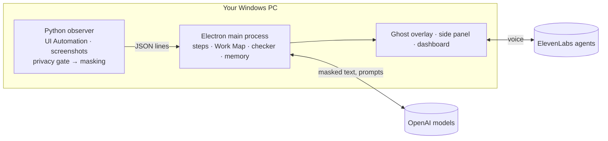

<div align="center">


# Apprentice

**Show it once. The apprentice remembers.**

An AI apprentice for Windows. It learns how your best people work, asks *why* at the right moments,<br />
and coaches new hires on their own screen, without ever reading a password.

[Website](#the-website) · [Download](#make-the-download-button-work) · [Quick start](#quick-start-windows) · [How it works](#how-it-works) · [Privacy](#privacy)

<br />


<br />


</div>

<br />

## What it does

When an expert leaves, what they knew leaves with them. Apprentice sits next to them while they do their normal work, writes the steps down, asks about the reasons behind them, and then passes all of it on to the next person.

<table>
  <tr>
    <td width="33%" valign="top">
      
      <h3>Capture</h3>
      Watches the expert work: every field, click and screen, read through Windows accessibility and masked on the spot. At natural pauses, an ElevenLabs voice asks <em>why</em>.
    </td>
    <td width="33%" valign="top">
      
      <h3>Map</h3>
      Turns the session into an editable step guide and a Work Map of decisions and rules, in the expert's own words, confirmed by them in a short spoken debrief.
    </td>
    <td width="33%" valign="top">
      
      <h3>Teach</h3>
      A ghost sits beside the new hire, flies to the right field, and stops a mistake before it's saved, explained the way the expert explained it.
    </td>
  </tr>
</table>

And it keeps learning: in the background it builds an **App Profile** for every app the team uses, from masked text only, so it knows the exceptions nobody thought to record.

## Web or desktop

There are two ways in. The **website** works in any Chrome or Edge, with nothing to install. The **desktop app** is the full apprentice.

| | Website | Desktop app |
|---|:---:|:---:|
| A screenshot every time the screen changes | ✓ | ✓ |
| Video with your voice, your words next to each step | ✓ | ✓ |
| Field names and the values you typed | | ✓ |
| Clicks and keys as named steps | | ✓ |
| Passwords never read; cards, IBANs and keys masked | | ✓ |
| Asks *why* at natural pauses, by voice | | ✓ |
| Work Map of decisions and rules | | ✓ |
| Learns every app 24/7 and coaches new hires | | ✓ |

A web page only gets the pixels of the screen you share. It can't see into other apps, which is why the website sends people to the desktop app for the rest.

<table>
  <tr>
    <td width="50%"></td>
    <td width="50%"></td>
  </tr>
  <tr>
    <td align="center"><sub>Recording in the browser: the first ten seconds are for your introduction</sub></td>
    <td align="center"><sub>The guide: your words next to each screenshot, ready to edit and share</sub></td>
  </tr>
</table>

## Quick start (Windows)

You need **Windows 10 or 11**, **[Node.js 20+](https://nodejs.org/en/download)** and **[Python 3.11+](https://www.python.org/downloads/windows/)** (tick *Add python.exe to PATH* when installing).

1. **Get the files.** Download `Apprentice-Windows.zip` from the website and unzip it, or clone this repository.
2. **Double-click `start.bat`.** The first run installs the app's parts (a few minutes). After that it starts straight away.
3. **Add your keys.** Notepad opens `app\.env` the first time. Fill it in, save, close Notepad, and the ghost appears.

| Key in `app/.env` | What it's for |
|---|---|
| `OPENAI_API_KEY` | Step descriptions, Work Maps, the mistake checker. Without it, every step falls back to a simpler local version. |
| `MODEL_FAST`, `MODEL_SMART` | Model names, e.g. `gpt-4.1-mini` and `gpt-4.1`. Both must accept images and JSON mode. |
| `ELEVENLABS_API_KEY` | The ghost's voice. |
| `VITE_AGENT_INTERVIEWER`, `VITE_AGENT_DEBRIEF`, `VITE_AGENT_TUTOR` | The three voice agents. How to create them: [`app/src/renderer/agents/README.md`](app/src/renderer/agents/README.md). |

<details>
<summary><b>Running it by hand</b></summary>

```powershell
cd sidecar; python -m pip install -r requirements.txt     # once
cd ..\app; npm install                                     # once
copy .env.example .env; notepad .env                       # once: add your keys
npm run dev                                                # start Apprentice
```

Replay a recorded session instead of watching the screen: `$env:OBSERVER_FAKE="..\fixtures\expert-session.jsonl"; npm run dev`.

</details>

## Make the download button work

The website's **Download for Windows** button links to whatever `downloadUrl` says in [`web/config.js`](web/config.js). There are two ways to give it something to download. This repository is **private**, so pick A unless you make the repository public.

### A. Serve the zip from the website (works with a private repository)

The button already points at `downloads/Apprentice-Windows.zip`, a file next to the website. Build that file, commit it, and every deploy includes it.

1. Build the zip from the last commit (it contains `app`, `sidecar`, `config`, `shared`, `start.bat` and this README):

   ```powershell
   scripts\make-download.ps1        # Windows
   ```
   ```bash
   sh scripts/make-download.sh      # macOS or Linux
   ```

2. Commit and push it:

   ```bash
   git add web/downloads/Apprentice-Windows.zip
   git commit -m "web: refresh the download"
   git push
   ```

3. Your host redeploys the website, and the button downloads the zip. Run the script again whenever the app changes.

### B. Publish a GitHub Release (needs a public repository)

1. Make the repository public: **Settings → General → Danger Zone → Change visibility**. Links into a private repository show visitors a 404 page.
2. Build the zip with the script above (you don't need to commit it this time).
3. On the repository page, open **Releases → Draft a new release**. Create a tag such as `v1.0.0`, give it a title, and drag `web/downloads/Apprentice-Windows.zip` into the assets box. Click **Publish release**.
4. Point the button at the newest release. In `web/config.js`:

   ```js
   downloadUrl: 'https://github.com/Ridwaan279/HackNation-7/releases/latest/download/Apprentice-Windows.zip',
   ```

   `releases/latest/download/<file>` always serves the newest release, so the link never needs changing again. Keep the file name the same in every release.
5. Commit and push `web/config.js`. The website redeploys with the new link.

**Check it:** open the deployed website, click **Download for Windows**, and confirm the zip downloads.

> **Later: a one-click installer.** Today the download runs the app from source through `start.bat`, which needs Node.js and Python. A proper installer would bundle the Python observer with PyInstaller, package the app with electron-builder, and run both in a GitHub Action on every tag. That isn't set up yet.

## The website

[`web/`](web) is a static site: plain HTML, CSS and JavaScript with no build step. It's the landing page, a web recorder, and the voice agent.

- **Record:** one click picks a window. It keeps a screenshot whenever the screen changes, records your voice into a video and writes down what you say. The first ten seconds are for your introduction.
- **Guide:** edit titles, reorder or delete steps, then download one HTML file, print a PDF, or download the video. Everything stays in the browser; nothing is uploaded.
- **Ask the ghost:** an ElevenLabs voice agent explains what the desktop app adds and scrolls the page to whatever it's talking about.

**Run it locally** (screen sharing needs `localhost` or `https`):

```bash
cd web && python -m http.server 5173     # open http://localhost:5173 in Chrome or Edge
```

**Deploy it:**

| Host | Settings |
|---|---|
| **Vercel** | Add New → Project → import this repository. Root Directory `web`, Framework Preset **Other**, no build command. Deploy. |
| **Netlify** | Add new site → import this repository. Base directory `web`, publish directory `web`, no build command. |
| **Cloudflare Pages** | Build command empty, build output directory `web`. |

Every push to `main` redeploys automatically. All three serve HTTPS, which screen sharing requires.

**Settings** live in [`web/config.js`](web/config.js): `downloadUrl` (above), `githubUrl`, and `elevenLabsAgentId` (below).

## Voice agents

The desktop app uses three ElevenLabs agents (Interviewer, Debrief, Tutor). Their prompts, first messages and tools are in [`app/src/renderer/agents/README.md`](app/src/renderer/agents/README.md).

<details>
<summary><b>The website agent ("Ask the ghost")</b></summary>

Without an agent, the website's button plays a short preview in the browser's own voice. To put the real ElevenLabs agent there:

1. In the ElevenLabs dashboard, open **Agents → Create agent → Blank agent**. Name it *Apprentice website*.
2. **First message:** `Hi, I'm the apprentice. Want to know what the desktop app can do that this page can't?`
3. **System prompt:**

   ```text
   You are the Apprentice ghost on the Apprentice website. Visitors are deciding whether to download
   the desktop app. Be warm and brief: two or three short sentences per turn, then let them talk.

   What you know:
   - The web recorder on this page records a window, keeps a screenshot whenever the screen changes,
     writes down what the expert says and turns it into a step-by-step guide. It stays in the browser.
   - A browser only sees pixels. The Windows desktop app reads every field through Windows
     accessibility: field names, typed values (masked), button names; clicks and keys become steps.
   - Privacy: password fields are never read. Card numbers, IBANs and API keys are masked on the
     computer before anything is stored. Password managers, banking sites and private windows are
     never watched. Ctrl+Shift+O goes off the record. Everything can be deleted in one click.
   - While the expert works, the desktop app asks why at natural pauses, by voice, and turns the
     answers into a Work Map of decisions and rules that the expert confirms.
   - It keeps learning every app the team uses, as masked text only, so it knows the exceptions.
   - For new hires, the ghost points at the right field and stops a mistake before it is saved.
   - Download: Windows 10 or 11. Unzip and double-click start.bat. It needs Node.js 20+ and
     Python 3.11+ and installs the rest the first time.

   Tools:
   - When you talk about part of the page, call show_section with one of:
     how, desktop, compare, teach, privacy, download.
   - When someone wants to download, call highlight_download and say the button is highlighted.

   Never invent features or prices. If you don't know, say so. Never ask for personal data.
   ```

4. **Tools → Add tool → Client tool**, twice. Tick *Wait for response* on both:
   - `show_section`: "Scrolls the website to a section and highlights it." One parameter, `section` (string, required): `how`, `desktop`, `compare`, `teach`, `privacy` or `download`.
   - `highlight_download`: "Scrolls to the download section and pulses the Download button." No parameters.
5. **Security:** leave authentication off (a static site can't sign requests), and add your website's domain to the allowlist so other sites can't use your agent.
6. Copy the agent ID (Agent settings, or the end of the agent's URL) into `web/config.js` as `elevenLabsAgentId`, then commit and push.

</details>

## Privacy

Privacy is built into the observer, not added afterwards. The order is always **privacy gate → masking → anything else**.

- **Never read:** password fields (`IsPassword` or password-like names), password managers, banking sites, private and incognito windows, and any app or site on your block list.
- **Masked on your computer before storing:** card numbers (keeps the last 4), IBANs, API keys and tokens, US Social Security numbers. Emails and phone numbers are optional.
- **Never stored:** printable keystrokes. Background screenshots are described in words, then deleted.
- **You're in charge:** pause for 15 minutes, an hour or until tomorrow; go off the record with **Ctrl+Shift+O**; delete any day, any app, or everything.
- **Keys stay put:** API keys live only in the desktop app's main process (`app/.env`), never in a window or on the website.

## How it works



- **`sidecar/`**: the Python observer. Hooks clicks and keys, reads controls through UI Automation, takes screenshots, and applies the privacy gate and masking before anything leaves it.
- **`app/`**: the Electron app. Services turn observer events into guides, Work Maps and App Profiles, decide when the voice agent may ask (only at natural pauses, and only after the expert has had ten seconds to introduce the task), and check a new hire's work against the expert's rules.
- **`web/`**: the website and web recorder.

<details>
<summary><b>Project layout</b></summary>

```text
app/           Electron app (main process services, ghost overlay, panel, dashboard, prompts)
sidecar/       Python observer (UI Automation, privacy, masking, screenshots) and its tests
shared/        Message contracts shared by the observer, the app and its windows
config/        Privacy and skip-list defaults
web/           Website and web recorder (static; deploy the folder)
fixtures/      Recorded sessions for replay, and the service tests
sandbox-erp/   MiniERP, a demo accounts-payable app
scripts/       Builds the website's download zip
docs/          Plan, status and images
start.bat      One-click start on Windows
```

</details>

<details>
<summary><b>Tests</b></summary>

```bash
cd sidecar && python -m pytest tests                          # observer: privacy, masking, engine
cd fixtures && npm install && npm run typecheck && npm test   # services, models stubbed
cd app && npm run typecheck && npm run build                  # the desktop app
```

</details>

<br />

<div align="center">
<sub>Built at Hack-Nation × ElevenLabs, 2026.</sub>
</div>
