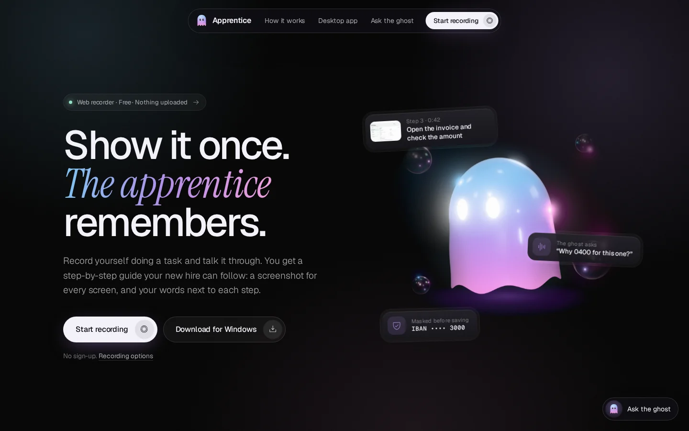
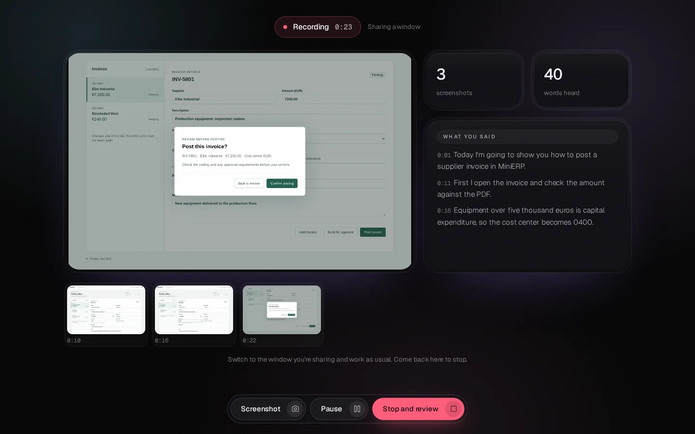
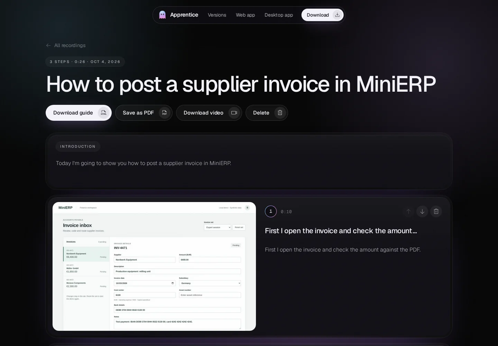
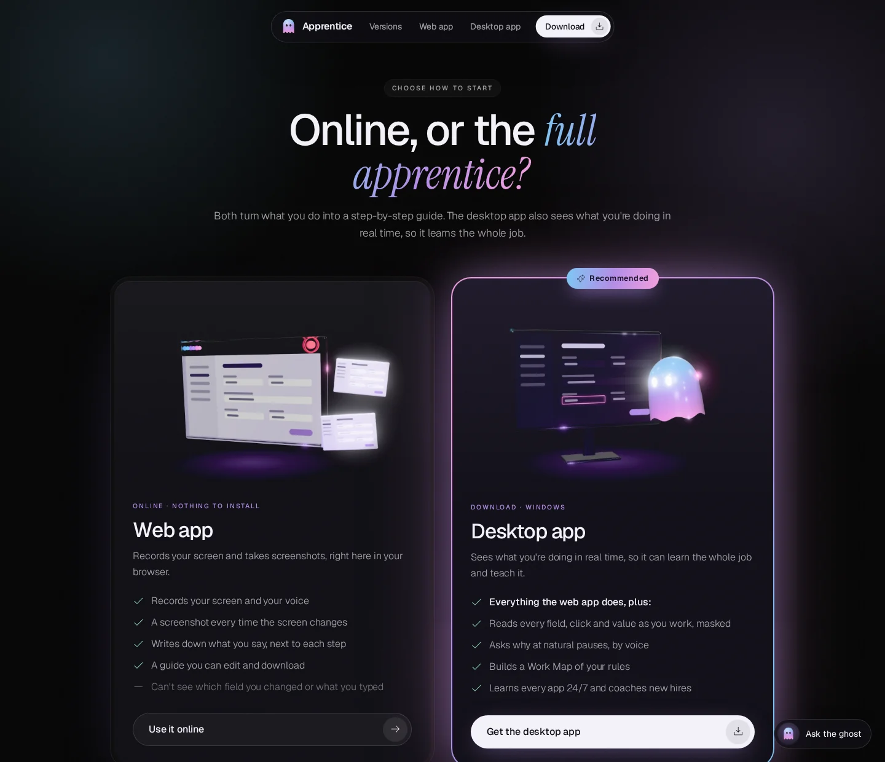
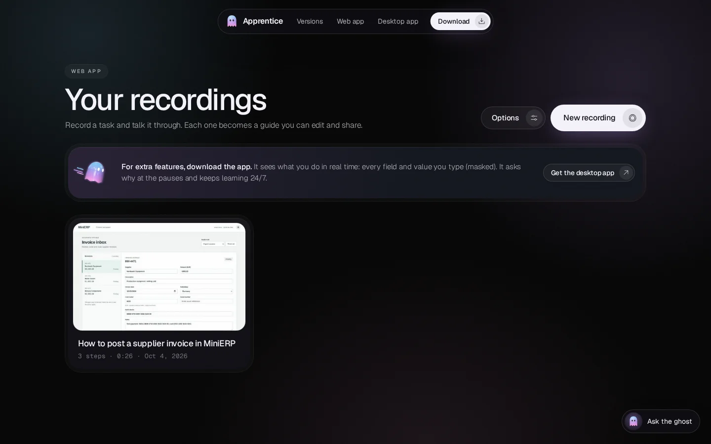
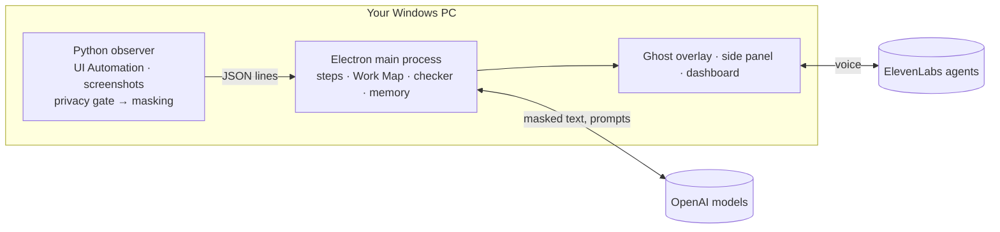

<div align="center">


# Protégé

**Show it once. Protégé remembers.**

AI onboarding that learns from your experts. It learns how your best people work, asks *why* at the right moments,<br />
and coaches new hires on their own screen, without ever reading a password.

[Website](#the-website) · [Download](#make-the-download-button-work) · [Quick start](#quick-start-windows) · [How it works](#how-it-works) · [Privacy](#privacy)

<br />


<br />



</div>

<br />

## What it does

When an expert leaves, what they knew leaves with them. Protégé sits next to them while they do their normal work, writes the steps down, asks about the reasons behind them, and then passes all of it on to the next person.

<table>
  <tr>
    <td width="33%" valign="top">
      
      <h3>Capture</h3>
      Watches the expert work: every field, click and screen, read through Windows accessibility and masked on the spot. At natural pauses, an ElevenLabs voice asks <em>why</em>.
    </td>
    <td width="33%" valign="top">
      
      <h3>Map</h3>
      Turns the session into an editable step guide and a Work Map of decisions and rules, in the expert's own words, confirmed by them in a short spoken debrief.
    </td>
    <td width="33%" valign="top">
      
      <h3>Teach</h3>
      A ghost sits beside the new hire, flies to the right field, and stops a mistake before it's saved, explained the way the expert explained it.
    </td>
  </tr>
</table>

And it keeps learning: in the background it builds an **App Profile** for every app the team uses, from masked text only, so it knows the exceptions nobody thought to record.

## Web or desktop

There are two ways in. The **website** works in any Chrome or Edge, with nothing to install. The **desktop app** is the full Protégé.

- **Web app: traditional onboarding.** You record a task. Protégé asks a question out loud whenever something needs explaining, and at the end it sums up what it saw and asks a few last questions.
- **Desktop app: onboarding that never stops.** It runs all the time, reads every task through Windows accessibility, and keeps training itself, so it catches what an expert forgets to explain. This is where we pushed the idea to its limit, and it's only possible because it runs on the computer, not in a browser.

| | Website | Desktop app |
|---|:---:|:---:|
| A screenshot every time the screen changes | ✓ | ✓ |
| Asks questions out loud while you record, then an overview and last questions | ✓ | ✓ |
| Video with your voice, your words next to each step | ✓ | ✓ |
| Runs all the time, not only while you record | | ✓ |
| Field names, typed values, clicks and keys through Windows accessibility | | ✓ |
| Passwords never read; cards, IBANs and keys masked | | ✓ |
| Work Map of decisions and rules | | ✓ |
| Learns every app 24/7 and coaches new hires | | ✓ |

A web page only gets the pixels of the screen you share. It can't see into other apps, which is why the website sends people to the desktop app for the rest.

<table>
  <tr>
    <td width="50%"></td>
    <td width="50%"></td>
  </tr>
  <tr>
    <td align="center"><sub>Recording in the browser: the first ten seconds are for your introduction</sub></td>
    <td align="center"><sub>The guide: your words next to each screenshot, ready to edit and share</sub></td>
  </tr>
</table>

## Quick start (Windows)

You need **Windows 10 or 11**, **[Node.js 20+](https://nodejs.org/en/download)** and **[Python 3.11+](https://www.python.org/downloads/windows/)** (tick *Add python.exe to PATH* when installing).

1. **Get the files.** Download `Protege-Windows.zip` from the website and unzip it, or clone this repository.
2. **Double-click `start.bat`.** The first run installs the app's parts (a few minutes). After that it starts straight away.
3. **Add your keys.** Notepad opens `app\.env` the first time. Fill it in, save, close Notepad, and the ghost appears.

| Key in `app/.env` | What it's for |
|---|---|
| `OPENAI_API_KEY` | Step descriptions, Work Maps, the mistake checker. Without it, every step falls back to a simpler local version. |
| `MODEL_FAST`, `MODEL_SMART` | Model names, e.g. `gpt-4.1-mini` and `gpt-4.1`. Both must accept images and JSON mode. |
| `ELEVENLABS_API_KEY` | The ghost's voice. |
| `VITE_AGENT_INTERVIEWER`, `VITE_AGENT_DEBRIEF`, `VITE_AGENT_TUTOR` | The three voice agents. How to create them: [`app/src/renderer/agents/README.md`](app/src/renderer/agents/README.md). |

<details>
<summary><b>Running it by hand</b></summary>

```powershell
cd sidecar; python -m pip install -r requirements.txt     # once
cd ..\app; npm install                                     # once
copy .env.example .env; notepad .env                       # once: add your keys
npm run dev                                                # start Protégé
```

Replay a recorded session instead of watching the screen: `$env:OBSERVER_FAKE="..\fixtures\expert-session.jsonl"; npm run dev`.

</details>

## Make the download button work

The website's **Download for Windows** button links to whatever `downloadUrl` says in [`web/config.js`](web/config.js). There are two ways to give it something to download. This repository is **private**, so pick A unless you make the repository public.

### A. Serve the zip from the website (works with a private repository)

The button already points at `downloads/Protege-Windows.zip`, a file next to the website. Build that file, commit it, and every deploy includes it.

1. Build the zip from the last commit (it contains `app`, `sidecar`, `config`, `shared`, `start.bat` and this README):

   ```powershell
   scripts\make-download.ps1        # Windows
   ```
   ```bash
   sh scripts/make-download.sh      # macOS or Linux
   ```

2. Commit and push it:

   ```bash
   git add web/downloads/Protege-Windows.zip
   git commit -m "web: refresh the download"
   git push
   ```

3. Your host redeploys the website, and the button downloads the zip. Run the script again whenever the app changes.

### B. Publish a GitHub Release (needs a public repository)

1. Make the repository public: **Settings → General → Danger Zone → Change visibility**. Links into a private repository show visitors a 404 page.
2. Build the zip with the script above (you don't need to commit it this time).
3. On the repository page, open **Releases → Draft a new release**. Create a tag such as `v1.0.0`, give it a title, and drag `web/downloads/Protege-Windows.zip` into the assets box. Click **Publish release**.
4. Point the button at the newest release. In `web/config.js`:

   ```js
   downloadUrl: 'https://github.com/Ridwaan279/HackNation-7/releases/latest/download/Protege-Windows.zip',
   ```

   `releases/latest/download/<file>` always serves the newest release, so the link never needs changing again. Keep the file name the same in every release.
5. Commit and push `web/config.js`. The website redeploys with the new link.

**Check it:** open the deployed website, click **Download for Windows**, and confirm the zip downloads.

> **Later: a one-click installer.** Today the download runs the app from source through `start.bat`, which needs Node.js and Python. A proper installer would bundle the Python observer with PyInstaller, package the app with electron-builder, and run both in a GitHub Action on every tag. That isn't set up yet.

## The website

[`web/`](web) is a static site: plain HTML, CSS and JavaScript with no build step.

1. **Kickstart.** The front page is the ghost and one button. Press **Kickstart** and Protégé starts talking.
2. **Choose.** It explains the two versions side by side and recommends the desktop app, which has the glowing border:
   - **Web app:** traditional onboarding. You record, it asks questions, then sums up and asks what's missing.
   - **Desktop app:** always on. It reads every task through Windows accessibility and keeps training itself.
3. **Overview.** Whichever you pick, Protégé explains that version. Switch between them and it starts that explanation again. The desktop page ends with the moonshot: why the idea only reaches its limit as an app.
4. **Then:**
   - **Web app:** a short onboarding (company, your role, what you're teaching, who it's for), then the dashboard. While you record, Protégé asks out loud at natural pauses and writes your answers next to the step. When you stop, it gives an overview and asks a few last questions, then opens the guide.
   - **Desktop app:** the download button and the three install steps. The app asks the same onboarding questions on first start.

<table>
  <tr>
    <td width="50%"></td>
    <td width="50%"></td>
  </tr>
  <tr>
    <td align="center"><sub>After Kickstart: the two versions, desktop recommended</sub></td>
    <td align="center"><sub>The web app dashboard: every recording becomes a guide</sub></td>
  </tr>
</table>

Recordings stay in the browser (IndexedDB). Nothing is uploaded.

**Run it locally** (screen sharing needs `localhost` or `https`):

```bash
cd web && python -m http.server 5173     # open http://localhost:5173 in Chrome or Edge
```

**Deploy it:**

| Host | Settings |
|---|---|
| **Vercel** | Add New → Project → import this repository. Root Directory `web`, Framework Preset **Other**, no build command. Deploy. |
| **Netlify** | Add new site → import this repository. Base directory `web`, publish directory `web`, no build command. |
| **Cloudflare Pages** | Build command empty, build output directory `web`. |

Every push to `main` redeploys automatically. All three serve HTTPS, which screen sharing requires.

**Protégé's voice.** On Vercel, the site speaks with a natural ElevenLabs voice through [`web/api/tts.js`](web/api/tts.js), a small serverless function that keeps the key on the server:

1. In Vercel, open the project → **Settings → Environment Variables**.
2. Add `ELEVENLABS_API_KEY` (the key needs the **Text to Speech** permission). Optionally add `ELEVENLABS_VOICE_ID` to pick another voice; the default is *Sarah*, calm and natural. Optionally add `ELEVENLABS_TTS_MODEL` (default `eleven_multilingual_v2`).
3. Redeploy. Each spoken line is cached by Vercel, so a repeated line costs nothing.

Without the function (another host, or running it locally), the site uses the most natural voice the browser has, and says so in small print.

**Settings** live in [`web/config.js`](web/config.js): `downloadUrl` (above), `githubUrl`, and `elevenLabsAgentId` (below).

## Voice agents

The desktop app uses three ElevenLabs agents (Interviewer, Debrief, Tutor). Their prompts, first messages and tools are in [`app/src/renderer/agents/README.md`](app/src/renderer/agents/README.md).

<details>
<summary><b>The website agent (Kickstart and "Ask the ghost")</b></summary>

Without an agent, Kickstart plays a spoken tour (the ElevenLabs voice on Vercel, otherwise the browser's): it highlights the two versions while it talks, and narrates whichever one you pick. To put the real ElevenLabs agent there:

1. In the ElevenLabs dashboard, open **Agents → Create agent → Blank agent**. Name it *Protégé website*.
2. **Voice:** pick a natural one in the agent's **Voice** tab (for example *Sarah*), the same as the website's.
3. **First message:** `Hi, I'm Protégé. I learn how your experts work and teach it to whoever comes next. You can use me online, or download me for Windows. Want me to explain the difference?`
4. **System prompt:**

   ```text
   You are Protégé, the guide on the Protégé website. The visitor pressed Kickstart. The page shows
   two options side by side: the web app on the left and the desktop app on the right, which is
   recommended. Be warm and brief: two or three short sentences per turn.

   Explain the two versions and recommend the desktop app:
   - Web app: traditional onboarding, in the browser, nothing to install. The expert records a task;
     Protégé asks questions out loud whenever something needs explaining; at the end it sums up what it
     saw and asks a few last questions. It only learns while recording, and only sees pixels.
   - Desktop app (Windows 10 or 11): onboarding that never stops. It runs all the time, reads every
     task through Windows accessibility (field names, typed values masked, clicks and keys), keeps
     training itself and catches what the expert forgot to explain. It builds a Work Map of the rules
     and coaches new hires on their own screen, stopping mistakes before they are saved.
   - The moonshot: we pushed this idea to its limit, and that was only possible as an app, not in a
     browser. The browser sees pixels; the app sees the work.
   - Privacy: password fields are never read; cards, IBANs and keys are masked on the computer;
     password managers, banking sites and private windows are never watched; Ctrl+Shift+O goes off
     the record; everything can be deleted.
   - Install: download the zip, unzip it, double-click start.bat. It needs Node.js 20+ and
     Python 3.11+ and installs the rest the first time.

   Tools:
   - show_options: bring the two options back on screen.
   - highlight_download: highlight the desktop app (or its download button) when you recommend it.
   - open_mode with mode "web" or "desktop": open that version when the visitor chooses.

   Messages in [square brackets] come from the website, not the visitor: they say what the visitor
   just opened. Answer them out loud as asked.
   Never invent features or prices. If you don't know, say so. Never ask for personal data.
   ```

5. **Tools → Add tool → Client tool**, three times. Tick *Wait for response* on each:
   - `show_options`: "Shows the web app and desktop app options side by side." No parameters.
   - `highlight_download`: "Highlights the recommended desktop app, or its download button." No parameters.
   - `open_mode`: "Opens one version's overview." One parameter, `mode` (string, required): `web` or `desktop`.
6. **Security:** leave authentication off (a static site can't sign requests), and add your website's domain to the allowlist so other sites can't use your agent.
7. Copy the agent ID (Agent settings, or the end of the agent's URL) into `web/config.js` as `elevenLabsAgentId`, then commit and push.

</details>

## Privacy

Privacy is built into the observer, not added afterwards. The order is always **privacy gate → masking → anything else**.

- **Never read:** password fields (`IsPassword` or password-like names), password managers, banking sites, private and incognito windows, and any app or site on your block list.
- **Masked on your computer before storing:** card numbers (keeps the last 4), IBANs, API keys and tokens, US Social Security numbers. Emails and phone numbers are optional.
- **Never stored:** printable keystrokes. Background screenshots are described in words, then deleted.
- **You're in charge:** pause for 15 minutes, an hour or until tomorrow; go off the record with **Ctrl+Shift+O**; delete any day, any app, or everything.
- **Keys stay put:** API keys live only in the desktop app's main process (`app/.env`), never in a window or on the website.

## How it works



- **`sidecar/`**: the Python observer. Hooks clicks and keys, reads controls through UI Automation, takes screenshots, and applies the privacy gate and masking before anything leaves it.
- **`app/`**: the Electron app. Services turn observer events into guides, Work Maps and App Profiles, decide when the voice agent may ask (only at natural pauses, and only after the expert has had ten seconds to introduce the task), and check a new hire's work against the expert's rules.
- **`web/`**: the website and web recorder.

<details>
<summary><b>Project layout</b></summary>

```text
app/           Electron app (main process services, ghost overlay, panel, dashboard, prompts)
sidecar/       Python observer (UI Automation, privacy, masking, screenshots) and its tests
shared/        Message contracts shared by the observer, the app and its windows
config/        Privacy and skip-list defaults
web/           Website and web recorder (static; deploy the folder)
fixtures/      Recorded sessions for replay, and the service tests
sandbox-erp/   MiniERP, a demo accounts-payable app
scripts/       Builds the website's download zip
docs/          Plan, status and images
start.bat      One-click start on Windows
```

</details>

<details>
<summary><b>Tests</b></summary>

```bash
cd sidecar && python -m pytest tests                          # observer: privacy, masking, engine
cd fixtures && npm install && npm run typecheck && npm test   # services, models stubbed
cd app && npm run typecheck && npm run build                  # the desktop app
```

</details>

<br />

<div align="center">
<sub>Built at Hack-Nation × ElevenLabs, 2026.</sub>
</div>
